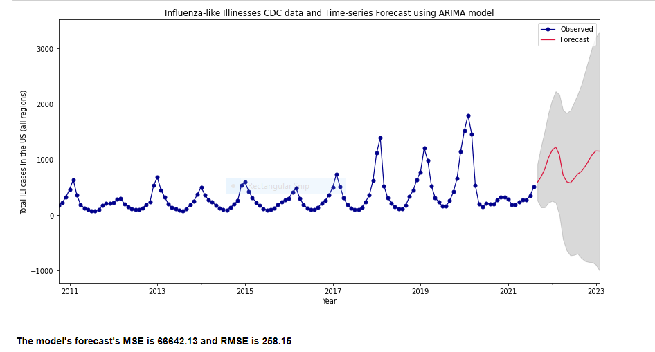
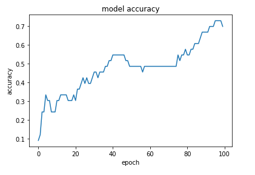
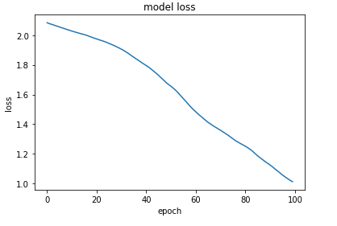

## TimeSeries forecasting using ARIMA model and Watson Chatbot

This repo contains two projects (same Jupyter notebook)

(1) A time-series influenza infection forecasting using ARIMA/sARIMA model  
(2) A retrievel-based chatbot using IBM Watson Natural Language Understanding API. 

AutoRegressive Integrated Moving Avergage or ARIMA is a widely used forecasting model in stock price prediction. It has demonstrated to outperform in precision and accuracy of predicting the next lags of time series. [1] ARIMA implements three primary parameteres (p, d, q) to make a prediction based on historical trends. <b>p</b> is the number of lag observations included in the model, aka the lag order, <b>d</b> is the count on the raw observations that are differentiated, aka the degree of differencing, and <b>q</b> is the size of the moving average window, aka order or MA. 

This is a sample of work, I undertook to predict influenza cases in the future such that our users (EMS and Fire Departments) are able to make decisions based on these models. 

 

_____________

Given the nature of this role, I decided to build a quick retrieval-based chatbot using IBM Watson's NLP resources. Disclaimer: I had never used Watson Assistant or NLU resources, but it was a good learning curve. I did not realise how well equipped it's platform was already established.  

This process involved created an IBM cloud account https://cloud.ibm.com/login?state=%2Faccount%2Fbest-practices&sessionExpired=true then starting a free version of Watson NLU. I, then collected all the API keys and URLs necessary. I was able to download a JSON file with queries. I trained a neural network on the corpus with ReLU activation. Accuracy was nearing 72% and loss nearly down to 1, this was expected given the corpus size limitation. Having that said there is no mathematical relationship between accuracy and loss metrics so I took that as a grain of salt. [2]

 

 

- - - - - - -

References:

[1] https://arxiv.org/ftp/arxiv/papers/1803/1803.06386.pdf

[2] https://docs.paperspace.com/machine-learning/wiki/accuracy-and-loss
